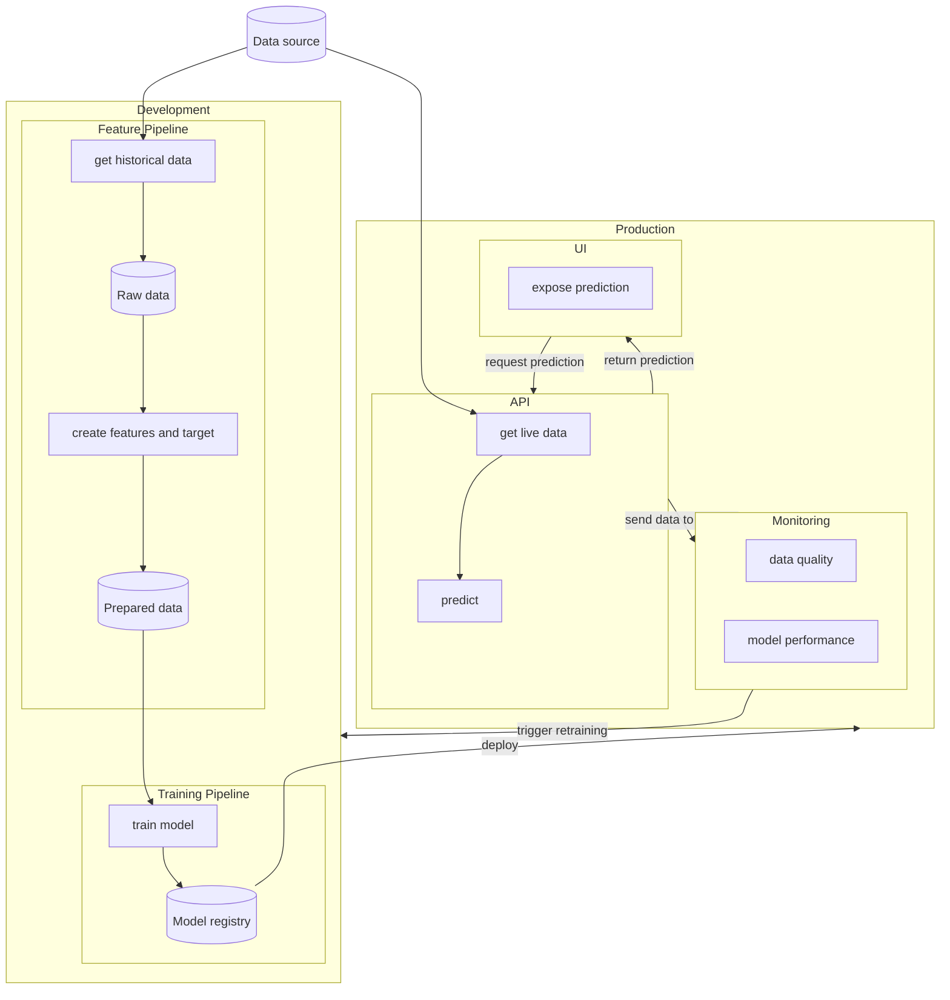

# fishstick
E2E stock market prediction using machine learning

# Purpose
This project is intended for personal use/learning as a demo of E2E machine learning project with use case for stock market prediction.

# Outline

